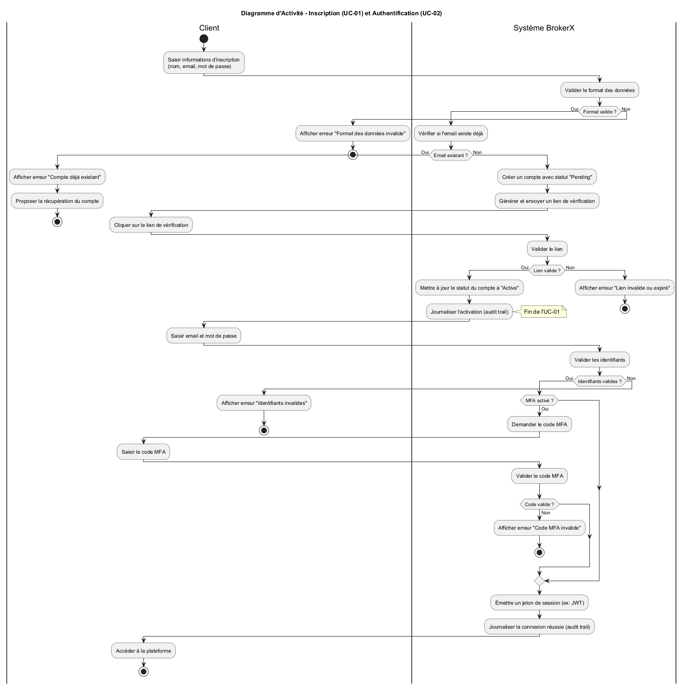
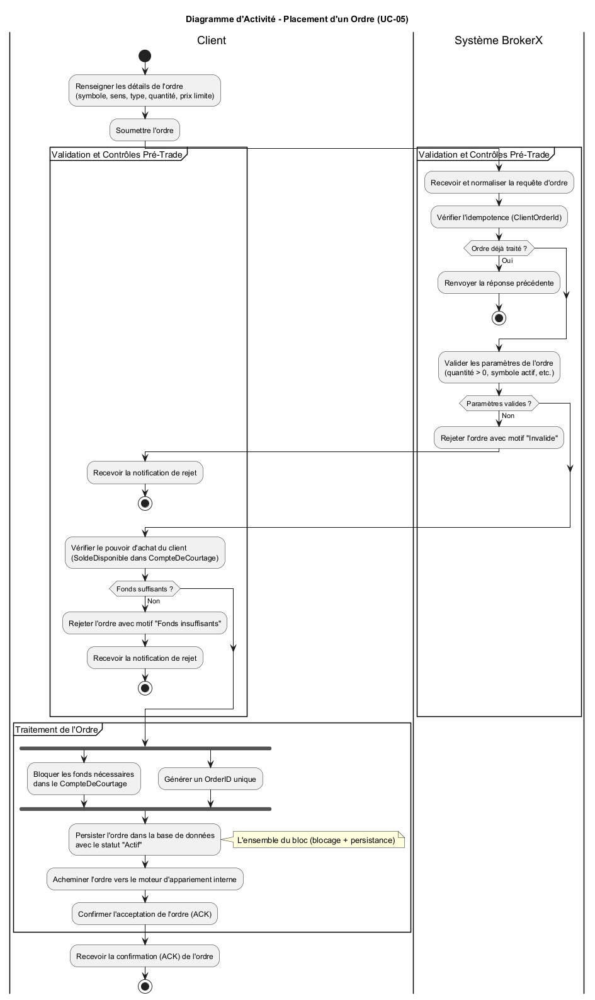
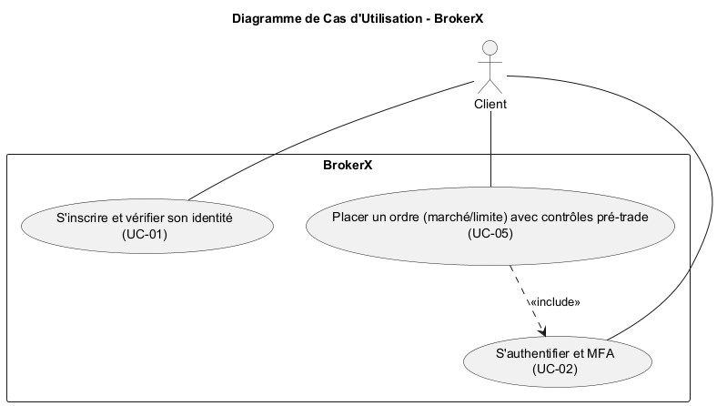
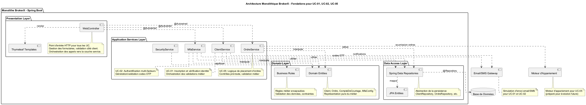
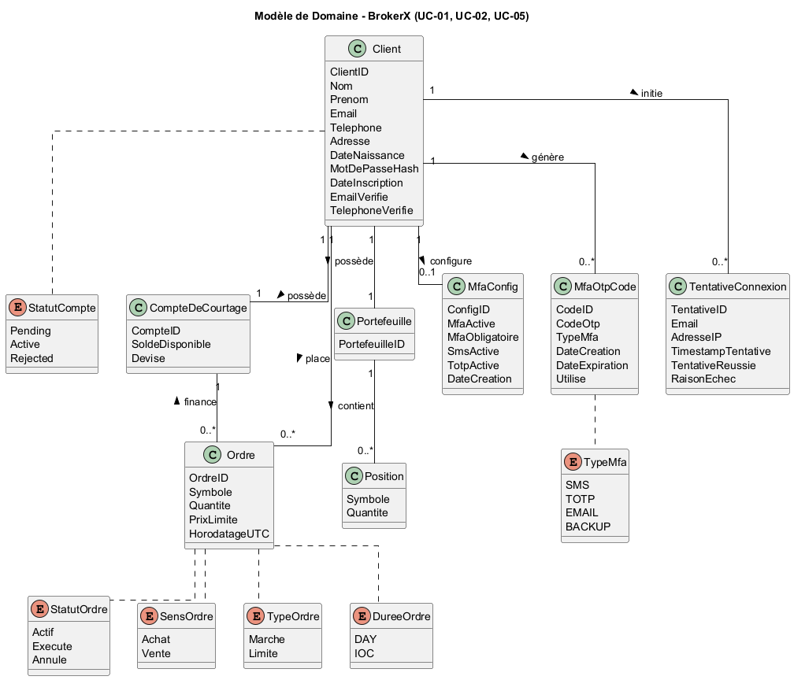
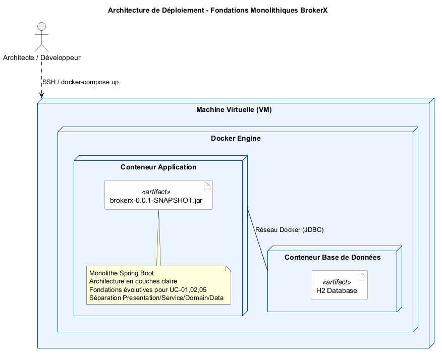

# BrokerX - Documentation d'Architecture
Ce document, basé sur le modèle arc42, décrit l'application de courtage BrokerX pour le projet de fondations architecturales, LOG320.

## 1. Introduction et Objectifs

### Panorama des exigences
L'application « BrokerX » est un système web monolithique pour la gestion sécurisée des clients et des ordres de courtage financier. Elle sert de projet éducatif pour démontrer :
- L'implémentation d'une architecture monolithique Spring Boot bien structurée
- La séparation en couches avec responsabilités claires (Presentation, Services, Domain, Data Access)
- L'authentification multi-facteurs (MFA) obligatoire pour la sécurité financière
- Les fondations architecturales évolutives permettant une future transition vers les microservices

L'application implémente trois cas d'utilisation prioritaires :
- **UC-01** : Inscription de client avec vérification d'identité (email/SMS)
- **UC-02** : Authentification sécurisée avec MFA obligatoire
- **UC-05** : Placement d'ordres avec contrôles pré-trade (architecture préparée)

### Objectifs qualité
| Priorité | Objectif qualité | Scénario |
|----------|------------------|----------|
| 1 | **Sécurité** | Authentification MFA obligatoire, audit complet, protection contre brute force |
| 2 | **Maintenabilité** | Architecture en couches avec séparation claire des responsabilités |
| 3 | **Évolutivité** | Fondations permettant évolution vers architecture distribuée |
| 4 | **Testabilité** | Injection de dépendances et abstractions pour tests unitaires |

### Parties prenantes (Stakeholders)
- **Architecte système** : Conception des fondations architecturales évolutives
- **Développeur.euses** : Implémentation respectant les bonnes pratiques Spring Boot
- **Clients du courtage** : Utilisateurs finaux s'inscrivant et s'authentifiant de manière sécurisée
- **Auditeurs sécurité** : Vérification de la conformité des contrôles d'accès et de traçabilité

## 2. Contraintes d'architecture

| Contrainte | Description |
|------------|-------------|
| **Technologie** | Spring Boot 3.2.0, Java 21+, H2 Database, Thymeleaf, Bootstrap 5 |
| **Sécurité** | MFA obligatoire, audit complet, protection contre attaques par force brute |
| **Déploiement** | Monolithe Spring Boot avec base de données embarquée H2 |
| **Évolutivité** | Architecture préparée pour décomposition future en microservices |

## 3. Portée et contexte du système

### Contexte métier


Le système permet aux clients de :
- S'inscrire avec vérification complète d'identité (email + SMS)
- S'authentifier de manière sécurisée avec MFA obligatoire
- Configurer leurs méthodes d'authentification multi-facteurs
- Bénéficier d'un audit complet de sécurité



### Contexte technique
- **Interface web** : Application Spring Boot avec templates Thymeleaf sur port 8081
- **Base de données** : H2 embarquée avec console de développement `/h2-console`
- **Sécurité** : Système MFA complet avec génération OTP, validation et audit
- **Architecture** : Monolithe en couches avec séparation claire des responsabilités

## 4. Stratégie de solution

| Problème | Approche de solution |
|----------|---------------------|
| **Sécurité financière** | MFA obligatoire avec SMS/TOTP, audit complet, protection IP |
| **Architecture évolutive** | Couches bien séparées permettant future décomposition |
| **Maintenabilité** | Services métier spécialisés avec injection de dépendances |
| **Testabilité** | Abstractions via repositories Spring Data JPA |

## 5. Vue des blocs de construction




L'architecture se compose de quatre couches principales :

### Presentation Layer
- **WebController** : Point d'entrée HTTP, gestion formulaires, validation
- **Templates Thymeleaf** : Vues avec Bootstrap pour UI responsive

### Application Services Layer  
- **ClientService** : Orchestration inscription et gestion clients (UC-01)
- **MfaService** : Génération/validation codes OTP, gestion MFA (UC-02)
- **SecurityService** : Audit connexions, protection brute force
- **OrdreService** : Logique placement ordres (UC-05, préparé)

### Domain Layer
- **Entités métier** : Client, Ordre, CompteDeCourtage, Position
- **Entités MFA** : MfaConfig, MfaOtpCode, TentativeConnexion
- **Règles métier** : Validation, contraintes et énumérations

### Data Access Layer
- **Spring Data Repositories** : Abstraction persistance
- **JPA Entities** : Mapping objet-relationnel avec H2

## 6. Vue d'exécution

Les diagrammes d'activité montrent les flux principaux :

- **UC-01** : Inscription → Validation → Vérification email → Activation compte
- **UC-02** : Connexion → Validation identifiants → MFA → Audit → Accès
- **UC-05** : Ordre → Contrôles pré-trade → Validation → Traitement

## 7. Vue de déploiement


Architecture de déploiement Docker complètement implémentée :
- **Conteneur brokerx-web** : Application Spring Boot dans image Eclipse Temurin 21-JRE Alpine
- **Dockerfile multi-stage** : Build avec JDK, runtime optimisé avec JRE
- **Volume persistant** : `brokerx_data` pour base H2 (`/app/data`)
- **Volume logs** : `brokerx_logs` pour journalisation (`/app/logs`)
- **Healthcheck intégré** : Surveillance via `/actuator/health` (30s/10s/3 retries)
- **Réseau Docker** : `brokerx-network` bridge isolé
- **Port mapping** : `8081:8081` pour accès web
- **Variables d'environnement** : Configuration via profil Docker (`SPRING_PROFILES_ACTIVE=docker`)

### Commandes de déploiement
```bash
# Démarrage complet
docker compose up --build -d

# Vérification santé
docker compose ps
docker compose logs -f brokerx-web
```

## 8. Concepts transversaux

### Sécurité
- **MFA obligatoire** : Tous les comptes nécessitent une authentification à deux facteurs
- **Audit complet** : Traçabilité de toutes les tentatives de connexion
- **Protection IP** : Limitation des tentatives par adresse IP
- **Hashage sécurisé** : Mots de passe protégés avec algorithmes robustes

### Persistance
- **Spring Data JPA** : Abstraction de la couche d'accès aux données
- **H2 Database** : Base embarquée pour développement, facilement remplaçable
- **Transactions** : Gestion automatique via annotations Spring

### Validation
- **Côté serveur** : Validation complète des données avec Spring Validation
- **Côté client** : Interface responsive avec Bootstrap et validation JavaScript
- **Règles métier** : Encapsulation dans la couche domaine

### Conteneurisation et Déploiement
- **Docker multi-stage** : Build optimisé (JDK) + Runtime léger (JRE Alpine)
- **Docker Compose** : Orchestration simplifiée avec volumes persistants
- **Configuration par profils** : Séparation local/docker via `application-docker.properties`
- **Healthcheck intégré** : Monitoring automatique via Spring Boot Actuator
- **Volumes Docker** : Persistance des données H2 et logs entre redémarrages
- **Isolation réseau** : Conteneur dans réseau bridge dédié
- **Variables d'environnement** : Configuration externalisée (JAVA_OPTS, etc.)

## 9. Décisions d'architecture

Quatre décisions architecturales majeures documentées dans `/docs/adr/adr.md` :

1. **ADR 001** : Architecture monolithique Spring Boot avec séparation en couches
2. **ADR 002** : Authentification multi-facteurs (MFA) obligatoire  
3. **ADR 003** : Base de données H2 embarquée pour le développement
4. **ADR 004** : Conteneurisation Docker avec déploiement Docker Compose

## 10. Exigences qualité

### Sécurité
- MFA obligatoire pour tous les comptes
- Audit complet avec traçabilité IP et timestamps
- Protection contre les attaques par force brute
- Validation stricte côté serveur

### Maintenabilité
- Séparation claire des couches et responsabilités
- Services métier spécialisés avec injection de dépendances
- Code auto-documenté avec conventions Spring Boot

### Évolutivité
- Architecture préparée pour décomposition en microservices
- Abstractions permettant changement de SGBD
- Services métier indépendants facilitant la distribution future

### Testabilité
- Injection de dépendances facilitant les mocks
- Couches testables indépendamment
- Repositories abstraits pour tests avec base en mémoire

## 11. Risques et dettes techniques

### Risques identifiés
- **Performance** : Monolithe unique point de charge (acceptable pour phase initiale)
- **Scalabilité** : H2 limitée pour forte concurrence (migration PostgreSQL prévue)
- **Sécurité SMS** : Simulation actuelle (intégration service réel nécessaire)

### Dettes techniques
- Migration vers PostgreSQL pour la production
- Intégration service SMS/email réel
- Tests d'intégration complets à ajouter

## 12. Glossaire

| Terme | Définition |
|-------|------------|
| **MFA** | Multi-Factor Authentication : authentification à deux facteurs |
| **OTP** | One-Time Password : code à usage unique avec expiration temporelle |
| **TOTP** | Time-based One-Time Password : OTP basé sur l'horloge (Google Authenticator) |
| **Pré-trade** | Contrôles de validation avant exécution d'un ordre de bourse |
| **Spring Boot** | Framework Java pour applications web avec configuration automatique |
| **JPA** | Java Persistence API : standard pour mapping objet-relationnel |
| **H2** | Base de données relationnelle embarquée Java |
| **Thymeleaf** | Moteur de templates pour applications web Spring |